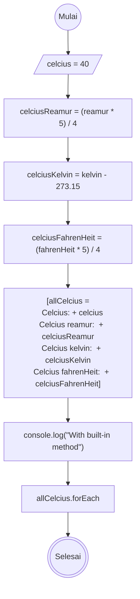
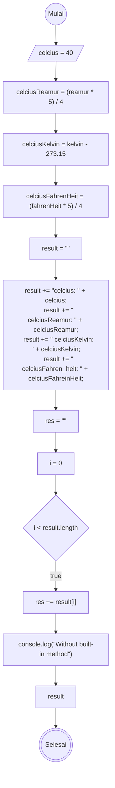

# Converter suhu dengan built-in method dan tanpa built-in method

## flowchart built-in method

```mermaid
    flowchart TD
    A((Mulai))
    B[/celcius = 40/]
    C["celciusReamur = (reamur * 5) / 4"]
    D["celciusKelvin = kelvin - 273.15"]
    E["celciusFahrenHeit = (fahrenHeit * 5) / 4"]
    F["[allCelcius =
    Celcius: + celcius
    Celcius reamur:  + celciusReamur
    Celcius kelvin:  + celciusKelvin
    Celcius fahrenHeit:  + celciusFahrenHeit]"]
    G["console.log(#quot;With built-in method#quot;)"]
    H[allCelcius.forEach]
    X(((Selesai)))

    A --> B
    B --> C
    C --> D
    D --> E
    E --> F
    F --> G
    G --> H
    H --> X
```

## flowchart without built-in method

```mermaid
    flowchart TD
    A((Mulai))
    B[/celcius = 40/]
    C["celciusReamur = (reamur * 5) / 4"]
    D["celciusKelvin = kelvin - 273.15"]
    E["celciusFahrenHeit = (fahrenHeit * 5) / 4"]
    F[result = #quot;#quot;]
    G[result += #quot;celcius: #quot; + celcius;
    result += #quot; celciusReamur: #quot; + celciusReamur;
    result += #quot; celciusKelvin: #quot; + celciusKelvin;
    result += #quot; celciusFahren_heit: #quot; + celciusFahreinHeit;]
    H[res = #quot;#quot;]
    I[i = 0]
    J{i < result.length}
    K["res += result[i]"]
    L["console.log(#quot;Without built-in method#quot;)"]
    M[result]
    X(((Selesai)))

    A --> B
    B --> C
    C --> D
    D --> E
    E --> F
    F --> G
    G --> H
    H --> I
    I --> J
    J -- true --> K
    K --> L
    L --> M
    M --> X
```
